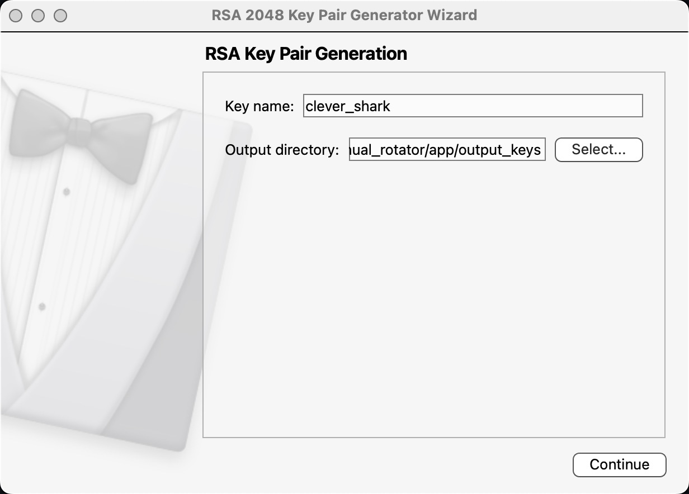
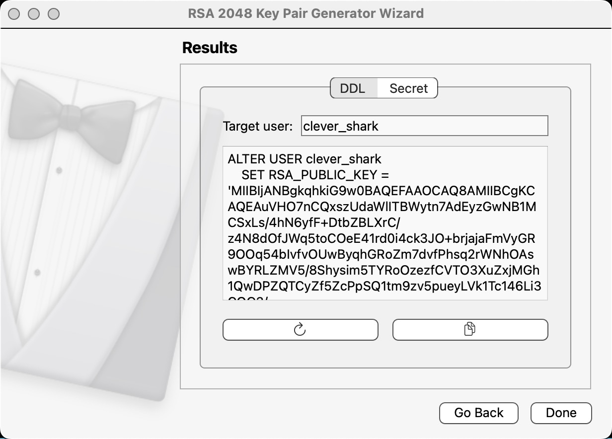
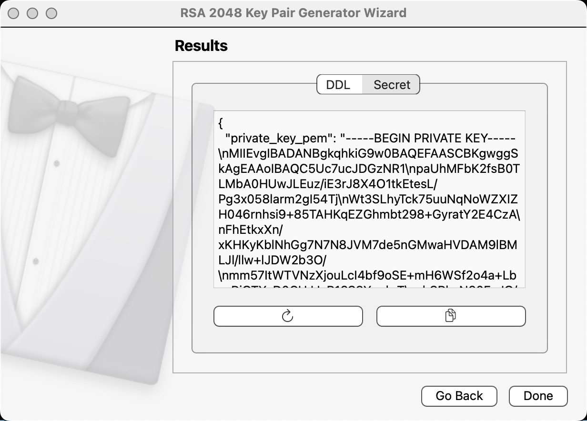

# RSA 2048 Key Pair Generator (GUI)

This project allows you to generate a pair of RSA keys (public and private) of 2048 bits in PEM format without passphrase, using a graphical interface built with PySide6. Compatible with macOS M1.

## Requirements
- Python 3.8+
- macOS (tested on M1)

## Installation

### Option 1: Using uv (recommended)

1. Install `uv` if you don't have it:
   ```bash
   pip install uv
   # or globally:
   pipx install uv
   ```
2. Create the virtual environment:
   ```bash
   uv venv
   ```
3. Activate the virtual environment:
   ```bash
   source .venv/bin/activate
   ```
4. Install the dependencies:
   ```bash
   uv pip install -r requirements.txt
   ```

### Option 2: Using venv and pip

1. Clone this repository and enter the project directory:
   ```bash
   cd app
   ```
2. Install the dependencies:
   ```bash
   python3 -m venv venv
   source venv/bin/activate
   pip install -r requirements.txt
   ```

## Usage

Run the graphical application:

```bash
python gui.py
```

1. Enter the base name for the keys.
2. Select the output directory.
3. Click on "Next".

Two files will be created in the selected directory:
- `<name>_private.pem`
- `<name>_public.pem`

## Notes
- The keys are generated without passphrase.
- The format is standard PEM. 





